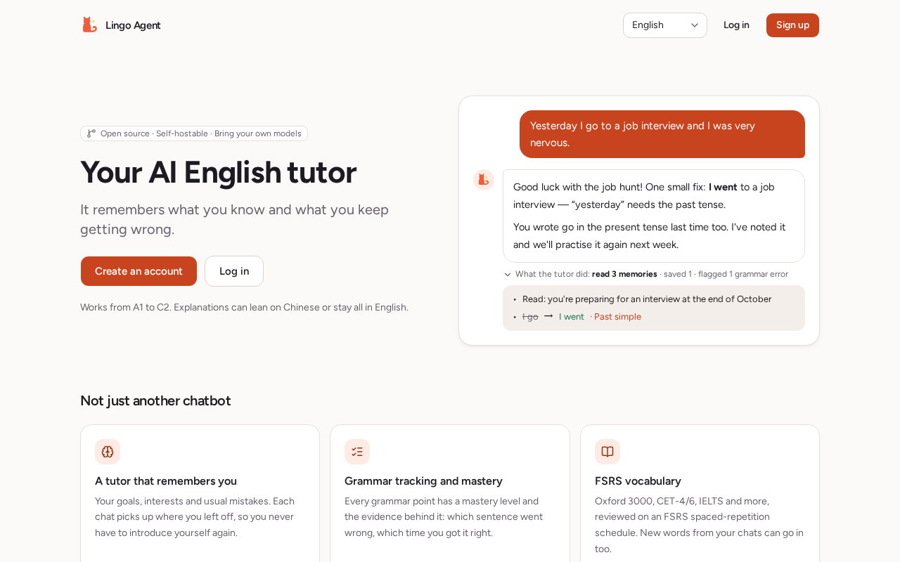
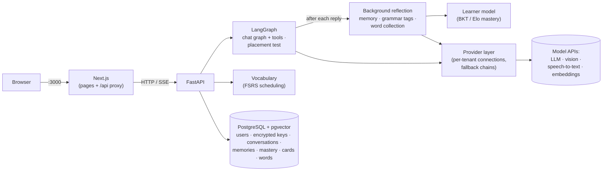

# lingo-agent

[](https://github.com/YangD1/lingo-agent/actions/workflows/ci.yml)

English | [简体中文](README.zh-CN.md)

An open-source AI English tutor agent. The goal: a tutor that remembers you, adapts what it teaches to your level, assesses you against CEFR, schedules vocabulary review with FSRS, gives you news graded to your level, answers grammar questions from a knowledge graph, and talks with you by voice.

**Stack:** FastAPI · LangChain / LangGraph · PostgreSQL + pgvector · Next.js · OpenTelemetry

> **Status: P1, a working MVP.** The tutor chats, remembers you, tracks your grammar, schedules vocabulary review and places you on the CEFR scale. Reading, writing, the full adaptive engine and voice conversation come next. See [what works now](#what-works-now) and the [roadmap](docs/PLAN.md).

| | |
|---|---|
|  |  |
|  |  |

<sub>Screenshots use a demo account with scripted model replies.</sub>

## What works now

**Learning**

- **A tutor that remembers you.** After each reply, a background step decides what is worth remembering (your goals, interests, recurring problems) and summarizes the conversation. The **Memory** page shows everything it keeps, and you can edit or delete any of it.
- **Grammar tracking.** The same step tags your mistakes against 119 grammar points (A1–C2). Mastery is then updated by an algorithm (BKT and Elo), not scored by the model. The **Learner model** page shows each point with the evidence behind it, and you can delete any piece of evidence.
- **Vocabulary with FSRS.** Pick a word book (Oxford 3000, Zhongkao, Gaokao, CET-4/6, postgraduate entrance, IELTS, TOEFL or GRE), skip words you already know, and review daily on an FSRS schedule. The back of each card shows the Chinese meanings by part of speech and up to two real example sentences with human translations from Tatoeba; AI examples are written only when you ask. Unfamiliar words from your conversations are collected automatically.
- **Replies you can follow.** Above the message box, switch the tutor between mostly Chinese and mostly English (until you choose, it follows your level: mostly Chinese at A1–A2 or before the placement test); it applies from the next reply. Hover or tap an English word in a reply to see its pronunciation, meanings, base form and the sentence it is in, ask for AI example sentences, or add it to your words. Every reply can be read aloud with the browser's own voices: the best ones on the device are picked automatically (Edge's Natural, Chrome's Google, macOS Premium voices), Chinese and English each in their own, sentence by sentence; under **Settings → Read aloud** (or the gear next to **Read aloud**) you can choose the voices, an American or British accent and the English speed, kept in that browser. Replies can also be shown in Chinese or English; translations are saved, so switching back and forth calls no model.
- **Placement test.** About 10 minutes: up to 40 vocabulary and 20 grammar questions, adaptive, with no model involved. It sets your CEFR level. It can also mark your word book's words that you very likely know, all at once: you confirm first, and you can undo it.
- **Dashboard.** Word book progress, grammar mastery, skill estimates, common mistakes and a study calendar, plus today's conversation with the tutor. The algorithm picks what is worth doing and offers it as quick replies; the tutor talks it over with you, with cards you can confirm. One conversation a day, created with your first message, so opening the dashboard calls no model. Without a model you get the algorithm's picks as links.
- **Focused practice.** Start a conversation on one grammar point from the dashboard or the Learner model page. The tutor opens it and steers every turn toward that point.
- **Practice sets.** On the **Grammar practice** page, a set of short exercises (multiple choice, fill in the blank, find and fix, transform, translate, rewrite your own sentence) on the grammar points worth practising now. A model writes the items, a second model call (the critic) checks each one before you see it, and answers are graded by code where possible, by a model otherwise. Every answer is evidence for mastery; a point counts as learned only after correct answers on different days. You can flag a bad item.
- **Writing feedback.** On the **Writing** page, write 20–800 words on a task for your level, one of your own, or none. Each sentence comes back with its mistakes marked (tap one for the explanation and grammar point) and the corrected sentence below, plus four scores (task, coherence, vocabulary, grammar) and overall feedback. The mistakes go into your learner model; the scores are only shown. Paste a long piece of your writing into chat and it is handed to the writing coach, who reviews it the same way and links to the result. Deleting a piece removes its mistakes from your learner model too.
- **The tutor can act, with your consent.** In chat, the tutor can propose a word book or a learning goal as a card. Nothing changes until you confirm, and you can undo it. After the placement test, a planning conversation on the result page turns the result into a plan.

**Transparency**

- **What the tutor did.** Under each reply you can expand what the tutor read, which tools it called, and what it wrote down afterwards. [docs/agent-tools.md](docs/agent-tools.md) lists every tool and background step.
- **AI usage labels.** Each feature that calls a model has an "AI" badge. It shows which model tasks run and roughly how many tokens each use costs, before you click.
- **Background work you control.** Work the tutor does while you are away (for now, preparing your next practice set) can be switched off item by item under Settings → Background work. Owners set a daily token budget for all background calls (0 turns them off); what you start yourself is never limited. Scheduled jobs run inside the single backend process, so deploy one backend instance.

**Platform**

- **Bring your own models.** Each account adds model connections in the app: a preset (DeepSeek, Anthropic, OpenAI, Qwen, Groq, SiliconFlow, …) or any OpenAI-compatible endpoint. API keys are encrypted in the database. The app lists the models a connection offers; you choose the model order per task, with automatic fallback. A connection, or a single model in a task's order, can be switched off and back on without losing its settings.
- **Attachments in chat.** Images (read by a vision model); PDF, DOCX, TXT and Markdown documents (scanned PDF pages go to the vision model); voice messages recorded in the browser and audio files (transcribed by a speech-to-text model). You can check and correct the extracted text before sending.
- **Usage table:** calls, tokens, errors, fallbacks and latency per day and model.
- **English and Chinese UI.**

Not built yet (see [docs/PLAN.md](docs/PLAN.md)): daily plans, graded news reading and grammar GraphRAG (P2); optional server-side read-aloud and pre-generated word pronunciations (see ADR 0018), shadowing and real-time voice conversation (P3); evaluation sets, rate limiting and cost dashboards (P4).

## Quick start (Docker)

You need Docker with Compose v2, `make`, `openssl`, and [uv](https://docs.astral.sh/uv/) for the one-time word list import. The stack runs in about 1.7 GB of RAM (Postgres, backend and frontend are memory-capped); building the images the first time takes a few minutes.

```bash
git clone https://github.com/YangD1/lingo-agent.git
cd lingo-agent
make env   # creates .env with a fresh encryption key and JWT secret
make up    # builds and starts postgres + backend + frontend; migrations run automatically
make vocab-import   # once: downloads and imports the word list (about 15 seconds)
make sentences-import   # once, after vocab-import: example sentences for the flashcards (about 10 seconds)
```

The word list is [ECDICT](https://github.com/skywind3000/ECDICT) (MIT, 66 MB, pinned to one commit and checked by sha256). It is saved in `data/`, and about 38,000 words are imported: exam lists, the Oxford 3000, Collins-starred words and the 30,000 most frequent. The vocabulary pages and the placement test need it. You can run it again safely. If GitHub is unreachable, set `ECDICT_URL` to a mirror of the same file, or pass a local copy with `make vocab-import CSV=path/to/ecdict.csv`. Without uv on the host: download the file, then run `docker compose cp ecdict.csv backend:/tmp/` and `docker compose exec backend python -m app.services.vocab.import_ecdict --csv /tmp/ecdict.csv`.

Example sentences on the flashcards come from [Tatoeba](https://tatoeba.org) ([CC BY 2.0 FR](https://creativecommons.org/licenses/by/2.0/fr/)): English sentences with human Chinese translations, at most two per word, each linked to its page on Tatoeba. The three per-language exports (about 27 MB) are saved in `data/tatoeba/`; Tatoeba updates them weekly, so the import prints each file's date and sha256 instead of checking a fixed hash. Run `make sentences-import REFRESH=1` to fetch a newer export, or `make sentences-import DIR=path/to/exports` to use local copies. Words without a real sentence still have the "AI examples" button. Without uv on the host: download `eng/eng_sentences.tsv.bz2`, `cmn/cmn_sentences.tsv.bz2` and `cmn/cmn-eng_links.tsv.bz2` from <https://downloads.tatoeba.org/exports/per_language/> into one folder, run `docker compose cp that-folder backend:/tmp/tatoeba`, then `docker compose exec backend python -m app.services.vocab.import_tatoeba --dir /tmp/tatoeba`.

Then:

1. Open <http://localhost:3000> and create an account.
2. Go to **Settings → Model connections**, add a connection (for example DeepSeek), paste your API key, and save its default model.
3. Take the **Placement test** (about 10 minutes). On its result page you can talk the result over with the tutor, right there.
4. Go to **Chat** and start talking, or to **Vocabulary** to pick a word book. With a single connection you don't need to set any model order: its default model is used automatically.

`make ps` shows service status, `make logs` follows the logs, `make down` stops the stack (your data is kept in Docker volumes). `make help` lists every command.

> **Keep `.env` safe.** `CREDENTIALS_ENCRYPTION_KEYS` in it encrypts the API keys stored in the database: lose it and the stored keys can't be read (users have to enter them again). To rotate it, see `make rotate-credentials`.

## Configuring models

API keys are never put in `.env` or YAML files: each user enters their own in **Settings**. The YAML files in [`config/`](config) only define the presets and the default model order per task; `PROVIDERS_CONFIG` in `.env` picks the file.

Four tasks have their own ordered model list under **Settings**:

| Task | Used for | Needs |
|---|---|---|
| Chat model | Replies, practice openings and the planning conversation | Any chat model; tool calling for the tutor's cards (without it the tutor only gives links) |
| Background memory model | Memory, grammar tagging and word collection after each reply | Any chat model; a smaller, cheaper one is fine |
| Image model (vision) | Images and scanned PDF pages | A model that accepts images |
| Speech-to-text | Voice messages and audio files | An OpenAI-compatible `/audio/transcriptions` endpoint |

Any other task uses the default model order in `config/`. The chat and memory tasks and any other calls fall back to each connection's default model, so one connection is enough to start. Vision and speech-to-text never fall back: set them up explicitly. On each connection, the **Test** button can test the model for chat, speech-to-text or images. If you have the connection the embedding route in `config/` names (by default `openai`, for `text-embedding-3-small`), memories are searched by meaning. Otherwise the most recent ones are used.

For speech-to-text, the Groq and SiliconFlow presets are the easiest start. Groq and OpenAI refuse requests from some regions, mainland China included; SiliconFlow (`FunAudioLLM/SenseVoiceSmall`) is reachable there.

**A model server on your own machine (e.g. Ollama).** By default the backend refuses addresses on private networks, to protect a shared server from requests aimed at its internal network (SSRF). On a machine only you use:

1. Set `PROVIDER_ALLOW_PRIVATE_NETWORKS=true` in `.env` and run `make up` again.
2. Add a **Custom** connection. From the Docker stack, use `http://host.docker.internal:11434/v1`, not `localhost` (inside the container, `localhost` is the backend itself), and make Ollama listen beyond 127.0.0.1 (`OLLAMA_HOST=0.0.0.0`). A backend run directly on the host (see below) uses `http://localhost:11434/v1`, so the Ollama preset works as is.

**Local speech-to-text (optional, for development).** `make asr-up` starts [speaches](https://github.com/speaches-ai/speaches) (faster-whisper) on port 8200; the first start downloads the model. It needs about 1.4 GB of RAM while transcribing. Then, with private networks allowed, add a connection from the **Speaches** preset (base URL `http://asr:8000/v1` from the Docker stack, `http://localhost:8200/v1` from a host-run backend) and put `speaches:Systran/faster-whisper-small` on the speech-to-text route. See the comments in [`.env.example`](.env.example).


## Development

Besides Docker you need [uv](https://docs.astral.sh/uv/) (it installs Python 3.12 for you), Node.js 24 and pnpm (`corepack enable` gives you the version pinned in `frontend/package.json`).

```bash
make env            # if you haven't yet
make install        # backend and frontend dependencies, from the lockfiles
make dev-db         # only postgres, on localhost:5433
make migrate        # apply database migrations
make dev-backend    # API with auto-reload on :8000       (terminal 1)
make dev-frontend   # Next.js dev server on :3000         (terminal 2)
```

The frontend proxies `/api` to the backend, so open <http://localhost:3000> as before.

Tests and checks (they need `make dev-db`; tests use their own databases and never call real model APIs):

```bash
make test     # pytest + Vitest
make e2e      # Playwright; starts its own backend, frontend and a fake model
make lint     # ruff + mypy, eslint + TypeScript
make fmt      # format and autofix backend code
make ci       # everything CI runs, in the same order
```

CI ([`.github/workflows/ci.yml`](.github/workflows/ci.yml)) runs backend checks, frontend checks, the Docker build and the end-to-end tests on every push to `main` and every pull request.

## Architecture



The browser only talks to Next.js; the login cookie is httpOnly and requests reach the API through the same-origin proxy. Every model call goes through the provider layer, which builds each tenant's models from their own connections; business code never creates a vendor SDK client or hardcodes a model name. Models understand and write; algorithms keep the books: mastery is updated from evidence by BKT and Elo, reviews are scheduled by FSRS, and the placement test is scored without a model.

```
backend/app/     FastAPI app: api/ routes, agents/ LangGraph graphs, providers/ model access,
                 memory/ long-term memory and reflection, adaptive/ grammar points, mastery
                 and the placement algorithm, services/vocab/ word books and FSRS,
                 cards/ tutor tools, advice/, dashboard/, usage/, attachments/, prompts/,
                 credentials/ key encryption, db/ models and migrations
backend/tests/   pytest (unit + integration against a real Postgres)
frontend/        Next.js App Router, shadcn/ui, next-intl; e2e/ Playwright tests
config/          provider presets and default model order (dev / prod)
docs/            PLAN.md (design), PROGRESS.md (status), decisions/ (ADRs),
                 agent-tools.md (every tool and background step)
```

Design documents:

- [docs/PLAN.md](docs/PLAN.md): the full design and roadmap
- [docs/plans/P1-mvp.md](docs/plans/P1-mvp.md): the P1 implementation plan
- [docs/decisions/](docs/decisions): architecture decision records, e.g. [provider layer](docs/decisions/0002-provider-layer.md), [tenant credentials](docs/decisions/0004-tenant-credentials.md), [attachments](docs/decisions/0008-multimodal-attachments.md), [long-term memory](docs/decisions/0009-long-term-memory.md), [learner model](docs/decisions/0010-learner-model.md), [vocabulary and FSRS](docs/decisions/0011-vocabulary-and-fsrs.md), [agent tools and disclosure](docs/decisions/0013-agent-tools-and-disclosure.md), [AI usage labels](docs/decisions/0014-ai-usage-disclosure.md), [confirmation cards](docs/decisions/0015-tutor-tools-and-confirmation-cards.md)

## Deploying

The Docker stack is meant to run on a small server. Before exposing it:

- Set `APP_ENV=prod` and `PROVIDERS_CONFIG=config/providers.prod.yaml`. In prod the login cookie is only sent over HTTPS, so put an HTTPS reverse proxy in front of port 3000.
- Keep `PROVIDER_ALLOW_PRIVATE_NETWORKS=false`.
- Only the frontend port is public; Postgres and the backend listen on 127.0.0.1.
- The backend fetches the reading feeds every two hours. If some sources are unreachable from your server's network, set `FEED_HTTP_PROXY` (or `COMPOSE_FEED_HTTP_PROXY` for the compose backend); it is used for feeds only, and it checks addresses less strictly than a direct fetch (see `.env.example`).

## Contributing

Issues and pull requests are welcome. Please run `make ci` before opening a pull request and use [Conventional Commits](https://www.conventionalcommits.org/) (`feat:`, `fix:`, `docs:` …).

## License

[MIT](LICENSE)

Data used at runtime, downloaded by the import commands and not included in this repository: the word list from [ECDICT](https://github.com/skywind3000/ECDICT) (MIT) and example sentences from [Tatoeba](https://tatoeba.org) ([CC BY 2.0 FR](https://creativecommons.org/licenses/by/2.0/fr/)).

Reading articles are fetched by the backend from RSS feeds and kept only in your own database: [NASA news](https://www.nasa.gov/news-release/feed/) (US government work, public domain; Astronomy Picture of the Day is skipped) and [Global Voices](https://globalvoices.org) (CC BY 3.0; stories republished from partners are skipped). Feeds that learners add themselves are shown only inside their own tenant.
