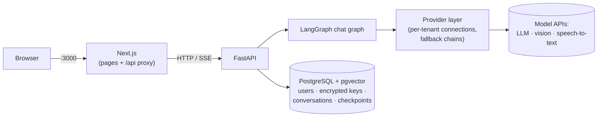

# lingo-agent

[](https://github.com/YangD1/lingo-agent/actions/workflows/ci.yml)

English | [简体中文](README.zh-CN.md)

An open-source AI English tutor agent. The goal: a tutor that remembers you, adapts what it teaches to your level, assesses you against CEFR, schedules vocabulary review with FSRS, gives you news graded to your level, answers grammar questions from a knowledge graph, and talks with you by voice.

**Stack:** FastAPI · LangChain / LangGraph · PostgreSQL + pgvector · Next.js · OpenTelemetry

> **Status: early (P0, the skeleton).** What runs today is the foundation the tutor is built on, not the tutor yet. See [what works now](#what-works-now) and the [roadmap](docs/PLAN.md).

## What works now

- **Accounts.** Sign up and log in; each account gets its own workspace (tenant).
- **Bring your own models.** Each user adds model connections in the app: a preset (DeepSeek, Anthropic, OpenAI, Qwen, Groq, SiliconFlow, …) or any OpenAI-compatible endpoint. API keys are encrypted in the database. The app lists the models a connection offers, and you choose the model order per task, with automatic fallback when one fails.
- **Streaming chat** with saved conversations.
- **Attachments in chat.** Images (read by a vision model), PDF, DOCX, TXT and Markdown documents (scanned PDF pages go to the vision model), and voice messages recorded in the browser or audio files (transcribed by a speech-to-text model). You can check and correct the extracted text before sending.
- **Usage table:** calls, tokens, errors, fallbacks and latency per day and model.
- **English and Chinese UI.**

Not built yet (planned in [docs/PLAN.md](docs/PLAN.md)): long-term memory, the adaptive learning engine, CEFR assessment, FSRS vocabulary, graded news, grammar GraphRAG, and real-time voice conversation.

## Quick start (Docker)

You need Docker with Compose v2, `make` and `openssl`. The stack runs in about 1.7 GB of RAM (Postgres, backend and frontend are memory-capped); building the images the first time takes a few minutes.

```bash
git clone https://github.com/YangD1/lingo-agent.git
cd lingo-agent
make env   # creates .env with a fresh encryption key and JWT secret
make up    # builds and starts postgres + backend + frontend; migrations run automatically
```

Then:

1. Open <http://localhost:3000> and create an account.
2. Go to **Settings → Model connections**, add a connection (for example DeepSeek), paste your API key, and save its default model.
3. Go to **Chat** and start talking. With a single connection you don't need to set any model order: its default model is used automatically.

`make ps` shows service status, `make logs` follows the logs, `make down` stops the stack (your data is kept in Docker volumes). `make help` lists every command.

> **Keep `.env` safe.** `CREDENTIALS_ENCRYPTION_KEYS` in it encrypts the API keys stored in the database: lose it and the stored keys can't be read (users have to enter them again). To rotate it, see `make rotate-credentials`.

## Configuring models

API keys are never put in `.env` or YAML files: each user enters their own in **Settings**. The YAML files in [`config/`](config) only define the presets and the default model order per task; `PROVIDERS_CONFIG` in `.env` picks the file.

Three tasks use models, each with its own ordered list under **Settings**:

| Task | Used for | Needs |
|---|---|---|
| Chat model | Replies | Any chat model |
| Image model (vision) | Images and scanned PDF pages | A model that accepts images |
| Speech-to-text | Voice messages and audio files | An OpenAI-compatible `/audio/transcriptions` endpoint |

For speech-to-text, the Groq and SiliconFlow presets are the easiest start. Groq and OpenAI refuse requests from some regions, mainland China included; SiliconFlow (`FunAudioLLM/SenseVoiceSmall`) is reachable there.

**A model server on your own machine (e.g. Ollama).** By default the backend refuses addresses on private networks, to protect a shared server from requests aimed at its internal network (SSRF). On a machine only you use:

1. Set `PROVIDER_ALLOW_PRIVATE_NETWORKS=true` in `.env` and run `make up` again.
2. Add a **Custom** connection. From the Docker stack, use `http://host.docker.internal:11434/v1`, not `localhost` (inside the container, `localhost` is the backend itself), and make Ollama listen beyond 127.0.0.1 (`OLLAMA_HOST=0.0.0.0`). A backend run directly on the host (see below) uses `http://localhost:11434/v1`, so the Ollama preset works as is.

**Local speech-to-text (optional, for development).** `make asr-up` starts [speaches](https://github.com/speaches-ai/speaches) (faster-whisper) on port 8200; the first start downloads the model. It needs about 1.4 GB of RAM while transcribing. Then, with private networks allowed, add a connection from the **Speaches** preset (base URL `http://asr:8000/v1` from the Docker stack, `http://localhost:8200/v1` from a host-run backend) and put `speaches:Systran/faster-whisper-small` on the speech-to-text route. See the comments in [`.env.example`](.env.example).

## Development

Besides Docker you need [uv](https://docs.astral.sh/uv/) (it installs Python 3.12 for you), Node.js 24 and pnpm (`corepack enable` gives you the version pinned in `frontend/package.json`).

```bash
make env            # if you haven't yet
make install        # backend and frontend dependencies, from the lockfiles
make dev-db         # only postgres, on localhost:5433
make migrate        # apply database migrations
make dev-backend    # API with auto-reload on :8000       (terminal 1)
make dev-frontend   # Next.js dev server on :3000         (terminal 2)
```

The frontend proxies `/api` to the backend, so open <http://localhost:3000> as before.

Tests and checks (they need `make dev-db`; tests use their own databases and never call real model APIs):

```bash
make test     # pytest + Vitest
make e2e      # Playwright; starts its own backend, frontend and a fake model
make lint     # ruff + mypy, eslint + TypeScript
make fmt      # format and autofix backend code
make ci       # everything CI runs, in the same order
```

CI ([`.github/workflows/ci.yml`](.github/workflows/ci.yml)) runs backend checks, frontend checks, the Docker build and the end-to-end tests on every push to `main` and every pull request.

## Architecture



The browser only talks to Next.js; the login cookie is httpOnly and requests reach the API through the same-origin proxy. Every model call goes through the provider layer, which builds each tenant's models from their own connections; business code never creates a vendor SDK client or hardcodes a model name.

```
backend/app/     FastAPI app: api/ routes, agents/ LangGraph graphs, providers/ model access,
                 credentials/ key encryption, attachments/, chat/, db/ models and migrations
backend/tests/   pytest (unit + integration against a real Postgres)
frontend/        Next.js App Router, shadcn/ui, next-intl; e2e/ Playwright tests
config/          provider presets and default model order (dev / prod)
docs/            PLAN.md (design), PROGRESS.md (status), decisions/ (ADRs)
```

Design documents:

- [docs/PLAN.md](docs/PLAN.md): the full design and roadmap
- [docs/decisions/](docs/decisions): architecture decision records, e.g. [provider layer](docs/decisions/0002-provider-layer.md), [auth and streaming](docs/decisions/0003-auth-and-streaming.md), [tenant credentials](docs/decisions/0004-tenant-credentials.md), [attachments](docs/decisions/0008-multimodal-attachments.md)

## Deploying

The Docker stack is meant to run on a small server. Before exposing it:

- Set `APP_ENV=prod` and `PROVIDERS_CONFIG=config/providers.prod.yaml`. In prod the login cookie is only sent over HTTPS, so put an HTTPS reverse proxy in front of port 3000.
- Keep `PROVIDER_ALLOW_PRIVATE_NETWORKS=false`.
- Only the frontend port is public; Postgres and the backend listen on 127.0.0.1.

## Contributing

Issues and pull requests are welcome. Please run `make ci` before opening a pull request and use [Conventional Commits](https://www.conventionalcommits.org/) (`feat:`, `fix:`, `docs:` …).

## License

[MIT](LICENSE)
