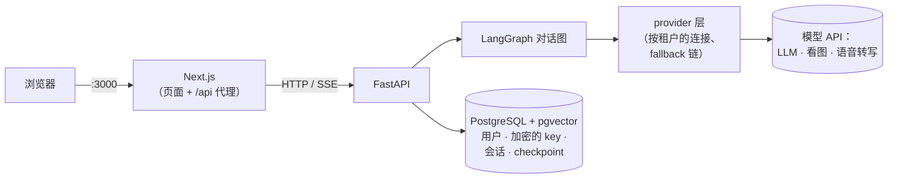

# lingo-agent

[](https://github.com/YangD1/lingo-agent/actions/workflows/ci.yml)

[English](README.md) | 简体中文

开源的 AI 英语私教 Agent。目标是做一个这样的私教：记得你是谁，按你的水平调整教什么，用 CEFR 标准评估你，用 FSRS 安排单词复习，给你推送按难度分级的新闻，基于知识图谱回答语法问题，还能和你语音对话。

**技术栈：** FastAPI · LangChain / LangGraph · PostgreSQL + pgvector · Next.js · OpenTelemetry

> **状态：早期（P0 骨架阶段）。** 现在能跑的是私教功能所依赖的底座，私教本身还没做出来。见[现在能做什么](#现在能做什么)和[路线图](docs/PLAN.md)。

## 现在能做什么

- **账号**：注册、登录；每个账号有自己独立的工作空间（租户）。
- **自带模型**：每个用户在应用里添加自己的模型连接，可以选预设（DeepSeek、Anthropic、OpenAI、通义千问、Groq、硅基流动等），也可以填任意 OpenAI 兼容地址。API key 加密存在数据库里。应用会列出连接提供的模型，你可以按任务排列模型顺序，某个模型出错时自动换下一个。
- **流式聊天**，会话会保存。
- **聊天附件**：图片（由看图模型读取）；PDF、DOCX、TXT、Markdown 文档（扫描版 PDF 的页面交给看图模型）；在浏览器里录的语音或音频文件（由语音转写模型转成文字）。发送前可以检查、修改提取出来的文字。
- **用量表**：按天、按模型统计调用次数、token、错误、fallback 次数和延迟。
- **中英文界面**。

还没做（规划见 [docs/PLAN.md](docs/PLAN.md)）：长期记忆、自适应学习引擎、CEFR 评估、FSRS 背单词、分级新闻、语法 GraphRAG、实时语音对话。

## 快速开始（Docker）

需要 Docker（含 Compose v2）、`make` 和 `openssl`。整套服务约占 1.7 GB 内存（Postgres、后端、前端都设了内存上限）；第一次构建镜像要几分钟。

```bash
git clone https://github.com/YangD1/lingo-agent.git
cd lingo-agent
make env   # 生成 .env，并随机生成加密主密钥和 JWT 密钥
make up    # 构建并启动 postgres + 后端 + 前端；数据库迁移自动执行
```

然后：

1. 打开 <http://localhost:3000>，注册一个账号。
2. 进入 **设置 → 模型连接**，添加一个连接（比如 DeepSeek），填入 API key，保存它的默认模型。
3. 进入 **对话** 开始聊天。只有一个连接时不需要设置模型顺序，会自动使用它的默认模型。

`make ps` 查看服务状态，`make logs` 跟踪日志，`make down` 停止服务（数据保存在 Docker volume 里，不会丢）。`make help` 列出所有命令。

> **保管好 `.env`。** 其中的 `CREDENTIALS_ENCRYPTION_KEYS` 用来加密数据库里的 API key：丢了它，已保存的 key 就无法读取，用户只能重新填写。轮换方法见 `make rotate-credentials`。

## 配置模型

API key 不放在 `.env` 或 YAML 文件里，由每个用户在 **设置** 里自己填写。[`config/`](config) 里的 YAML 只定义预设和每个任务的默认模型顺序，由 `.env` 里的 `PROVIDERS_CONFIG` 选择用哪一份。

有三个任务会用到模型，每个任务在 **设置** 里有自己的模型顺序：

| 任务 | 用途 | 要求 |
|---|---|---|
| 对话模型 | 生成回复 | 任意聊天模型 |
| 看图模型 | 读取图片和扫描版 PDF 的页面 | 支持图片输入的模型 |
| 语音转文字 | 转写语音消息和音频文件 | OpenAI 兼容的 `/audio/transcriptions` 接口 |

语音转文字最省事的是 Groq 和硅基流动两个预设。Groq 和 OpenAI 会拒绝部分地区（包括中国大陆）的请求；硅基流动（`FunAudioLLM/SenseVoiceSmall`）在大陆可以直接访问。

**用本机上的模型服务（比如 Ollama）**：后端默认拒绝私有网络地址，防止共享的服务器被借道访问它所在的内网（SSRF）。如果这台机器只有你自己用：

1. 在 `.env` 里设置 `PROVIDER_ALLOW_PRIVATE_NETWORKS=true`，再执行一次 `make up`。
2. 添加一个 **自定义** 连接。从 Docker 里访问要填 `http://host.docker.internal:11434/v1`，不能填 `localhost`（在容器里，`localhost` 指的是后端容器自己），同时让 Ollama 监听 127.0.0.1 以外的地址（`OLLAMA_HOST=0.0.0.0`）。如果后端直接跑在宿主机上（见下文），填 `http://localhost:11434/v1`，Ollama 预设可以直接用。

**本地语音转写（可选，开发用）**：`make asr-up` 会在 8200 端口启动 [speaches](https://github.com/speaches-ai/speaches)（faster-whisper），第一次启动会下载模型，转写时约占 1.4 GB 内存。然后在允许私有网络的前提下，用 **Speaches** 预设添加连接（Docker 里的后端用 `http://asr:8000/v1`，宿主机上的后端用 `http://localhost:8200/v1`），把 `speaches:Systran/faster-whisper-small` 放进“语音转文字”的模型顺序。详见 [`.env.example`](.env.example) 里的注释。

## 本地开发

除了 Docker，还需要 [uv](https://docs.astral.sh/uv/)（会自动安装 Python 3.12）、Node.js 24 和 pnpm（执行 `corepack enable` 即可得到 `frontend/package.json` 里固定的版本）。

```bash
make env            # 如果还没生成过
make install        # 按锁文件安装后端和前端依赖
make dev-db         # 只启动 postgres，端口 localhost:5433
make migrate        # 执行数据库迁移
make dev-backend    # 后端，:8000，改代码自动重载        （终端 1）
make dev-frontend   # Next.js 开发服务器，:3000           （终端 2）
```

前端会把 `/api` 代理到后端，所以同样打开 <http://localhost:3000>。

测试和检查（需要先 `make dev-db`；测试使用独立的数据库，不会调用真实的模型 API）：

```bash
make test     # pytest + Vitest
make e2e      # Playwright；自己启动后端、前端和一个假模型
make lint     # ruff + mypy、eslint + TypeScript
make fmt      # 格式化并自动修复后端代码
make ci       # 按 CI 的顺序跑一遍 CI 的全部检查
```

CI（[`.github/workflows/ci.yml`](.github/workflows/ci.yml)）在每次推送到 `main` 和每个 pull request 时运行：后端检查、前端检查、Docker 构建和端到端测试。

## 架构



浏览器只和 Next.js 通信；登录 cookie 是 httpOnly 的，请求经同源代理到达后端 API。所有模型调用都经过 provider 层，它根据每个租户自己的连接构建模型；业务代码里不直接创建厂商 SDK 客户端，也不写死模型名。

```
backend/app/     FastAPI 应用：api/ 路由，agents/ LangGraph 图，providers/ 模型访问，
                 credentials/ key 加密，attachments/，chat/，db/ 模型和迁移
backend/tests/   pytest（单元测试 + 连真实 Postgres 的集成测试）
frontend/        Next.js App Router、shadcn/ui、next-intl；e2e/ 是 Playwright 测试
config/          provider 预设和默认模型顺序（dev / prod）
docs/            PLAN.md（设计）、PROGRESS.md（进度）、decisions/（ADR）
```

设计文档：

- [docs/PLAN.md](docs/PLAN.md)：完整设计和路线图
- [docs/decisions/](docs/decisions)：架构决策记录，比如 [provider 层](docs/decisions/0002-provider-layer.md)、[鉴权与流式](docs/decisions/0003-auth-and-streaming.md)、[租户凭据](docs/decisions/0004-tenant-credentials.md)、[附件](docs/decisions/0008-multimodal-attachments.md)

## 部署

这套 Docker 服务的设计目标是能跑在低配服务器上。对外开放之前：

- 设置 `APP_ENV=prod` 和 `PROVIDERS_CONFIG=config/providers.prod.yaml`。prod 模式下登录 cookie 只通过 HTTPS 发送，所以要在 3000 端口前面加一个 HTTPS 反向代理。
- 保持 `PROVIDER_ALLOW_PRIVATE_NETWORKS=false`。
- 只有前端端口对外；Postgres 和后端只监听 127.0.0.1。

## 参与贡献

欢迎提 issue 和 pull request。提 PR 前请先跑一遍 `make ci`，提交信息使用 [Conventional Commits](https://www.conventionalcommits.org/zh-hans/)（`feat:`、`fix:`、`docs:` 等）。

## 许可证

[MIT](LICENSE)
