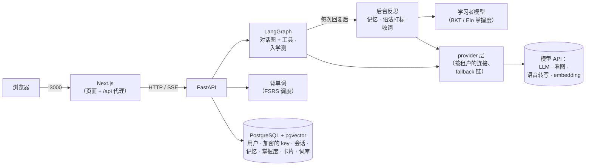

# lingo-agent

[](https://github.com/YangD1/lingo-agent/actions/workflows/ci.yml)

[English](README.md) | 简体中文

开源的 AI 英语私教 Agent。目标是做一个这样的私教：记得你是谁，按你的水平调整教什么，用 CEFR 标准评估你，用 FSRS 安排单词复习，给你推送按难度分级的新闻，基于知识图谱回答语法问题，还能和你语音对话。

**技术栈：** FastAPI · LangChain / LangGraph · PostgreSQL + pgvector · Next.js · OpenTelemetry

> **状态：P1，可用的 MVP。** 私教能对话、记住你、跟踪你的语法、安排单词复习、用 CEFR 给你定级。阅读、写作、完整的自适应引擎和语音对话在后面的阶段。见[现在能做什么](#现在能做什么)和[路线图](docs/PLAN.md)。

## 现在能做什么

**学习**

- **记得你的私教**：每次回复后，后台会判断哪些值得记住（你的目标、兴趣、反复出现的问题），并给会话写摘要。**记忆**页面列出它记住的全部内容，每一条都可以修改或删除。
- **语法跟踪**：同一个后台步骤会把你的错误标到 119 个语法点上（A1–C2）。掌握度由算法（BKT 和 Elo）根据这些证据更新，不由模型打分。**学习者模型**页面列出每个语法点和背后的证据，每条证据都可以删除。
- **FSRS 背单词**：选一本词书（牛津 3000、中考、高考、四级、六级、考研、雅思、托福、GRE），先筛掉认识的词，再按 FSRS 安排每天的复习。对话里遇到的生词会自动收进生词本。
- **读得懂私教的话**：输入框上方可以切换“多说中文 / 多说英文”（没选过时按等级：A1–A2 或还没定级时多说中文），从下一句开始生效。私教回复里的英文单词，悬停或点按就能看音标、释义、原形和原句，还可以生成 AI 例句、一键加入生词本。每条回复都能朗读：用浏览器自带的声音，自动挑这台设备上最好的（Edge 的 Natural、Chrome 的 Google、macOS 的 Premium 声音），中英文各用各的声音，逐句读；在**设置 → 朗读**（或朗读按钮旁的齿轮）里可以自己选声音、美音或英音、英文语速，设置存在当前浏览器。回复也能切换看中文版或英文版，译文保存下来，来回切换不再调用模型。
- **入学测**：大约 10 分钟，最多 40 道词汇题和 20 道语法题，自适应出题，不调用模型。结果会更新你的 CEFR 等级；还可以把词书里你大概率认识的词一次性标为熟词，要先确认，也可以撤销。
- **看板**：词书进度、语法掌握、技能估计、常错语法点和学习打卡，还有“今天的学习”：和私教的对话框。算法挑出值得做的事，作为快捷回复给你；私教和你商量，用卡片提议，你确认才执行。每天一段对话，你发第一条消息时才创建，所以打开看板不调模型。没配模型时显示算法挑的建议链接。
- **针对语法点的练习**：从看板或学习者模型页面，可以针对某个语法点开一个练习对话。私教会先开场，之后每一轮都围绕这个语法点。
- **私教可以代为安排，但要你同意**：对话里，私教可以用卡片提议换词书或设定学习目标。你确认之前什么都不会改，确认后还可以撤销。做完入学测后，可以在结果页直接和私教聊学习规划，把测试结果变成学习计划。

**公开透明**

- **私教做了什么**：每条回复下面可以展开，看私教读了什么、调用了哪些工具、回复后记下了什么。所有工具和后台步骤都列在 [docs/agent-tools.md](docs/agent-tools.md)。
- **AI 用量标记**：每个会调用模型的功能旁边都有“AI”标记，点之前就能看到会调用哪些模型任务、每次大约用多少 token。

**平台**

- **自带模型**：每个账号在应用里添加自己的模型连接，可以选预设（DeepSeek、Anthropic、OpenAI、通义千问、Groq、硅基流动等），也可以填任意 OpenAI 兼容地址。API key 加密存在数据库里。应用会列出连接提供的模型，你可以按任务排列模型顺序，某个模型出错时自动换下一个。
- **聊天附件**：图片（由看图模型读取）；PDF、DOCX、TXT、Markdown 文档（扫描版 PDF 的页面交给看图模型）；在浏览器里录的语音或音频文件（由语音转写模型转成文字）。发送前可以检查、修改提取出来的文字。
- **用量表**：按天、按模型统计调用次数、token、错误、fallback 次数和延迟。
- **中英文界面**。

还没做（规划见 [docs/PLAN.md](docs/PLAN.md)）：完整的自适应引擎（诊断、带 critic 校验的练习生成、每日计划）、分级新闻阅读、语法 GraphRAG、写作批改（P2）；可选的服务端朗读和单词发音预生成（见 ADR 0018）、跟读和实时语音对话（P3）；评估集、限流和成本看板（P4）。

## 快速开始（Docker）

需要 Docker（含 Compose v2）、`make`、`openssl`，以及用来导入词库（只需一次）的 [uv](https://docs.astral.sh/uv/)。整套服务约占 1.7 GB 内存（Postgres、后端、前端都设了内存上限）；第一次构建镜像要几分钟。

```bash
git clone https://github.com/YangD1/lingo-agent.git
cd lingo-agent
make env   # 生成 .env，并随机生成加密主密钥和 JWT 密钥
make up    # 构建并启动 postgres + 后端 + 前端；数据库迁移自动执行
make vocab-import   # 只需一次：下载并导入词库（约 15 秒）
```

词库来自 [ECDICT](https://github.com/skywind3000/ECDICT)（MIT 许可，66 MB，固定到某个提交并校验 sha256）。文件保存在 `data/`，其中约 3.8 万个词会被导入：考试词表、牛津 3000、柯林斯星级词和词频前 3 万的词。背单词和入学测都要用到它。可以重复执行。访问不了 GitHub 时，把 `ECDICT_URL` 设为同一文件的镜像地址，或者用 `make vocab-import CSV=path/to/ecdict.csv` 导入本地文件。宿主机上没有 uv 时：先下载文件，再执行 `docker compose cp ecdict.csv backend:/tmp/` 和 `docker compose exec backend python -m app.services.vocab.import_ecdict --csv /tmp/ecdict.csv`。

然后：

1. 打开 <http://localhost:3000>，注册一个账号。
2. 进入 **设置 → 模型连接**，添加一个连接（比如 DeepSeek），填入 API key，保存它的默认模型。
3. 做一次 **入学测**（约 10 分钟）。可以在结果页直接和私教聊聊这次结果。
4. 进入 **对话** 开始聊天，或者到 **背单词** 选一本词书。只有一个连接时不需要设置模型顺序，会自动使用它的默认模型。

`make ps` 查看服务状态，`make logs` 跟踪日志，`make down` 停止服务（数据保存在 Docker volume 里，不会丢）。`make help` 列出所有命令。

> **保管好 `.env`。** 其中的 `CREDENTIALS_ENCRYPTION_KEYS` 用来加密数据库里的 API key：丢了它，已保存的 key 就无法读取，用户只能重新填写。轮换方法见 `make rotate-credentials`。

## 配置模型

API key 不放在 `.env` 或 YAML 文件里，由每个用户在 **设置** 里自己填写。[`config/`](config) 里的 YAML 只定义预设和每个任务的默认模型顺序，由 `.env` 里的 `PROVIDERS_CONFIG` 选择用哪一份。

有四个任务在 **设置** 里有自己的模型顺序：

| 任务 | 用途 | 要求 |
|---|---|---|
| 对话模型 | 回复、练习开场、学习规划对话 | 任意聊天模型；私教的卡片需要模型支持工具调用（不支持时私教只能给链接） |
| 后台整理模型 | 每次回复后的记忆、语法打标和收词 | 任意聊天模型，用小一点、便宜一点的就行 |
| 看图模型（vision） | 读取图片和扫描版 PDF 的页面 | 支持图片输入的模型 |
| 语音转文字 | 转写语音消息和音频文件 | OpenAI 兼容的 `/audio/transcriptions` 接口 |

其他任务使用 `config/` 里的默认模型顺序。对话、后台整理和其他调用都会兜底到各连接的默认模型，所以一个连接就能开始用。看图和语音转文字不会兜底，要单独设置。每个连接的 **测试** 按钮可以选按对话、语音转写或看图来测。如果你有 `config/` 里 embedding 路由指定的连接（默认是 `openai`，用 `text-embedding-3-small`），记忆会按语义检索；否则取最近的几条。

语音转文字最省事的是 Groq 和硅基流动两个预设。Groq 和 OpenAI 会拒绝部分地区（包括中国大陆）的请求；硅基流动（`FunAudioLLM/SenseVoiceSmall`）在大陆可以直接访问。

**用本机上的模型服务（比如 Ollama）**：后端默认拒绝私有网络地址，防止共享的服务器被借道访问它所在的内网（SSRF）。如果这台机器只有你自己用：

1. 在 `.env` 里设置 `PROVIDER_ALLOW_PRIVATE_NETWORKS=true`，再执行一次 `make up`。
2. 添加一个 **自定义** 连接。从 Docker 里访问要填 `http://host.docker.internal:11434/v1`，不能填 `localhost`（在容器里，`localhost` 指的是后端容器自己），同时让 Ollama 监听 127.0.0.1 以外的地址（`OLLAMA_HOST=0.0.0.0`）。如果后端直接跑在宿主机上（见下文），填 `http://localhost:11434/v1`，Ollama 预设可以直接用。

**本地语音转写（可选，开发用）**：`make asr-up` 会在 8200 端口启动 [speaches](https://github.com/speaches-ai/speaches)（faster-whisper），第一次启动会下载模型，转写时约占 1.4 GB 内存。然后在允许私有网络的前提下，用 **Speaches** 预设添加连接（Docker 里的后端用 `http://asr:8000/v1`，宿主机上的后端用 `http://localhost:8200/v1`），把 `speaches:Systran/faster-whisper-small` 放进“语音转文字”的模型顺序。详见 [`.env.example`](.env.example) 里的注释。


## 本地开发

除了 Docker，还需要 [uv](https://docs.astral.sh/uv/)（会自动安装 Python 3.12）、Node.js 24 和 pnpm（执行 `corepack enable` 即可得到 `frontend/package.json` 里固定的版本）。

```bash
make env            # 如果还没生成过
make install        # 按锁文件安装后端和前端依赖
make dev-db         # 只启动 postgres，端口 localhost:5433
make migrate        # 执行数据库迁移
make dev-backend    # 后端，:8000，改代码自动重载        （终端 1）
make dev-frontend   # Next.js 开发服务器，:3000           （终端 2）
```

前端会把 `/api` 代理到后端，所以同样打开 <http://localhost:3000>。

测试和检查（需要先 `make dev-db`；测试使用独立的数据库，不会调用真实的模型 API）：

```bash
make test     # pytest + Vitest
make e2e      # Playwright；自己启动后端、前端和一个假模型
make lint     # ruff + mypy、eslint + TypeScript
make fmt      # 格式化并自动修复后端代码
make ci       # 按 CI 的顺序跑一遍 CI 的全部检查
```

CI（[`.github/workflows/ci.yml`](.github/workflows/ci.yml)）在每次推送到 `main` 和每个 pull request 时运行：后端检查、前端检查、Docker 构建和端到端测试。

## 架构



浏览器只和 Next.js 通信；登录 cookie 是 httpOnly 的，请求经同源代理到达后端 API。所有模型调用都经过 provider 层，它根据每个租户自己的连接构建模型；业务代码里不直接创建厂商 SDK 客户端，也不写死模型名。模型负责理解和生成，算法负责记账和调度：掌握度由 BKT 和 Elo 根据证据更新，复习由 FSRS 安排，入学测的判分也不经过模型。

```
backend/app/     FastAPI 应用：api/ 路由，agents/ LangGraph 图，providers/ 模型访问，
                 memory/ 长期记忆与反思，adaptive/ 语法点、掌握度和入学测算法，
                 services/vocab/ 词书与 FSRS，cards/ 私教工具，advice/，dashboard/，
                 usage/，attachments/，prompts/，credentials/ key 加密，db/ 模型和迁移
backend/tests/   pytest（单元测试 + 连真实 Postgres 的集成测试）
frontend/        Next.js App Router、shadcn/ui、next-intl；e2e/ 是 Playwright 测试
config/          provider 预设和默认模型顺序（dev / prod）
docs/            PLAN.md（设计）、PROGRESS.md（进度）、decisions/（ADR）、
                 agent-tools.md（全部工具和后台步骤）
```

设计文档：

- [docs/PLAN.md](docs/PLAN.md)：完整设计和路线图
- [docs/plans/P1-mvp.md](docs/plans/P1-mvp.md)：P1 实施计划
- [docs/decisions/](docs/decisions)：架构决策记录，比如 [provider 层](docs/decisions/0002-provider-layer.md)、[租户凭据](docs/decisions/0004-tenant-credentials.md)、[附件](docs/decisions/0008-multimodal-attachments.md)、[长期记忆](docs/decisions/0009-long-term-memory.md)、[学习者模型](docs/decisions/0010-learner-model.md)、[词库与 FSRS](docs/decisions/0011-vocabulary-and-fsrs.md)、[agent 工具与公示](docs/decisions/0013-agent-tools-and-disclosure.md)、[AI 用量标记](docs/decisions/0014-ai-usage-disclosure.md)、[确认卡](docs/decisions/0015-tutor-tools-and-confirmation-cards.md)

## 部署

这套 Docker 服务的设计目标是能跑在低配服务器上。对外开放之前：

- 设置 `APP_ENV=prod` 和 `PROVIDERS_CONFIG=config/providers.prod.yaml`。prod 模式下登录 cookie 只通过 HTTPS 发送，所以要在 3000 端口前面加一个 HTTPS 反向代理。
- 保持 `PROVIDER_ALLOW_PRIVATE_NETWORKS=false`。
- 只有前端端口对外；Postgres 和后端只监听 127.0.0.1。

## 参与贡献

欢迎提 issue 和 pull request。提 PR 前请先跑一遍 `make ci`，提交信息使用 [Conventional Commits](https://www.conventionalcommits.org/zh-hans/)（`feat:`、`fix:`、`docs:` 等）。

## 许可证

[MIT](LICENSE)
